# Home2 Sitemap & Missing Components Documentation

## Sitemap Overview

```mermaid
graph TD
    A[Home2 Landing Page<br/>/home2] --> B[Pre-Arrival<br/>/home2-pre-arrival]
    A --> C[Arrival<br/>/home2-arrival]
    A --> D[Treatment<br/>/home2-treatment]
    A --> E[Post-Treatment<br/>/home2-post-treatment]
    
    B --> C
    C --> D
    D --> E
    E --> A
    
    A --> F[#healing-journey<br/>Journey Overview Section]
    A --> G[#treatments<br/>Specialized Treatments Section]
    A --> H[#hospitals<br/>Hospital Network Section]
    A --> I[#why-choose<br/>Why Choose Malaysia Section]
    A --> J[#stories<br/>Patient Stories Section]
    A --> K[#news<br/>News & Events Section]
    A --> L[#footer<br/>Contact Information]
    
    %% Missing Pages - Highlighted in Red
    A -.-> M[About Us<br/>❌ Missing]
    A -.-> N[Contact Page<br/>❌ Missing]
    A -.-> O[Patient Guide<br/>❌ Missing]
    
    G -.-> P[Treatment Details<br/>❌ Missing]
    H -.-> Q[Hospital Details<br/>❌ Missing]
    K -.-> R[News Article Pages<br/>❌ Missing]
    K -.-> S[Events Pages<br/>❌ Missing]
    
    L -.-> T[Privacy Policy<br/>❌ Missing]
    L -.-> U[Terms of Service<br/>❌ Missing]
    
    %% Treatment Categories
    P -.-> V[Cardiology Details<br/>❌ Missing]
    P -.-> W[Oncology Details<br/>❌ Missing]
    P -.-> X[Orthopedics Details<br/>❌ Missing]
    P -.-> Y[Fertility Details<br/>❌ Missing]
    P -.-> Z[Neurology Details<br/>❌ Missing]
    P -.-> AA[Ophthalmology Details<br/>❌ Missing]
    
    %% Hospital Information
    Q -.-> AB[Individual Hospital Pages<br/>❌ Missing]
    Q -.-> AC[Hospital Search/Filter<br/>❌ Missing]
    
    style M fill:#ffcccc
    style N fill:#ffcccc
    style O fill:#ffcccc
    style P fill:#ffcccc
    style Q fill:#ffcccc
    style R fill:#ffcccc
    style S fill:#ffcccc
    style T fill:#ffcccc
    style U fill:#ffcccc
    style V fill:#ffcccc
    style W fill:#ffcccc
    style X fill:#ffcccc
    style Y fill:#ffcccc
    style Z fill:#ffcccc
    style AA fill:#ffcccc
    style AB fill:#ffcccc
    style AC fill:#ffcccc
```

## Missing Components & Data Requirements

### 1. **Hospital Data** 🏥
Currently using placeholder data. Need from client:
- **Hospital Information**:
  - Official hospital names
  - High-resolution logos
  - Actual GPS coordinates for map positioning
  - Specialties offered by each hospital
  - JCI accreditation status
  - Contact information
  - Website links
  - Brief descriptions

### 2. **Treatment/Specialty Pages** 💊
Need detailed content for each specialty:
- **Cardiology**
  - Specific procedures offered
  - Technology available
  - Success stories (anonymized)
  - Typical treatment duration
  - Cost ranges (if appropriate)
  
- **Oncology**
  - Cancer types treated
  - Treatment modalities
  - Support services
  
- **Orthopedics**
  - Joint replacement types
  - Sports medicine services
  - Rehabilitation programs
  
- **Fertility**
  - IVF success rates (if shareable)
  - Available treatments
  - Support services
  
- **Neurology**
  - Conditions treated
  - Advanced procedures
  - Diagnostic capabilities
  
- **Ophthalmology**
  - Eye procedures offered
  - Technology used
  - Recovery information

### 3. **Patient Stories** 👥
Currently using placeholder testimonials. Need:
- Real patient testimonials (with consent)
- Patient photos (with consent)
- Country of origin
- Treatment received
- Actual quotes
- Before/after images (if applicable and consented)

### 4. **News & Events Content** 📰
Need actual content for:
- Recent news articles about Malaysia healthcare
- Upcoming healthcare events
- Medical conferences
- Healthcare achievements
- Event registration links
- News article full content

### 5. **Static Pages Content** 📄
Missing pages that need content:
- **About Us Page**
  - MHTC history
  - Mission and vision
  - Team information
  - Government backing details
  
- **Contact Page**
  - Office locations
  - Department contacts
  - Inquiry forms
  - Office hours
  
- **Patient Guide**
  - Detailed pre-arrival checklist
  - Visa requirements by country
  - Insurance information
  - Cost estimation tools
  
- **Privacy Policy**
  - Data collection practices
  - Cookie policy
  - User rights
  
- **Terms of Service**
  - Service terms
  - Disclaimers
  - Legal information

### 6. **Functional Components** ⚙️
Need implementation for:
- **Information Search**
  - Hospital directory
  - Treatment information
  - General healthcare information
  
- **Language Switcher**
  - Translations for:
    - Bahasa Malaysia
    - Bahasa Indonesia
    - Mandarin
    - Arabic
  
- **Newsletter System**
  - Email collection for updates
  - Healthcare travel news
  - Event announcements
  
- **Inquiry Forms**
  - General inquiry forms
  - Request for information
  - Connect with MHTC team

### 7. **Media Assets** 🖼️
Currently using placeholders. Need:
- Hospital photos (exterior/interior)
- Medical facility images
- Treatment room photos
- Hero video for home2 (currently referenced but missing)
- Malaysia map SVG with accurate boundaries
- Doctor/staff photos
- Medical equipment images

### 8. **Additional Data Requirements** 📊
- **Visa Information**
  - Country-specific requirements
  - Processing times
  - Required documents
  
- **Cost Information**
  - Treatment cost ranges
  - Package options
  - Insurance partnerships
  
- **Support Services**
  - Airport transfer providers
  - Accommodation partners
  - Translation services
  - Halal food providers

### 9. **Promotional & Information Tools** 🔗
- **Contact Facilitation**
  - Inquiry forms that connect to MHTC team
  - Hospital contact directory
  - General information request forms
  
- **Information Tools**
  - General cost comparison information
  - Treatment overview guides
  - Downloadable brochures
  - Educational resources

## Priority Order for Client Data Collection

1. **High Priority** 🔴
   - Hospital data (names, logos, specialties)
   - Treatment/procedure information
   - Contact information
   - About Us content

2. **Medium Priority** 🟡
   - Patient testimonials
   - News content
   - Static page content
   - Media assets

3. **Low Priority** 🟢
   - Newsletter system
   - Advanced search features
   - Multi-language content
   - External integrations

## Questions for Client

1. **Hospital Network**
   - How many hospitals should be featured?
   - Which hospitals have priority placement?
   - Are all hospitals JCI accredited?
   
2. **Treatment Information**
   - Can we share general success rates?
   - What general cost information can be displayed?
   - Which treatments are most popular?
   
3. **Patient Stories**
   - Do we have consent to use patient stories?
   - Can we show before/after photos?
   - How many testimonials are available?
   
4. **Content Management**
   - Who will provide content updates?
   - How often is news updated?
   - What is the approval process for content?
   
5. **Legal & Compliance**
   - What disclaimers are required?
   - Are there regulatory restrictions?
   - What privacy laws apply?

## Next Steps

1. Schedule meeting with client to review missing components
2. Prioritize which sections to complete first
3. Create content templates for client to fill
4. Establish timeline for data delivery
5. Plan phased implementation based on data availability 