# Home2 Visual Sitemap

## Current Implementation Status

```mermaid
graph TB
    subgraph "✅ Implemented Pages"
        HOME[🏠 Home2<br/>/home2]
        PRE[📋 Pre-Arrival<br/>/home2-pre-arrival]
        ARR[✈️ Arrival<br/>/home2-arrival]
        TREAT[🏥 Treatment<br/>/home2-treatment]
        POST[💚 Post-Treatment<br/>/home2-post-treatment]
    end
    
    subgraph "✅ Implemented Sections"
        S1[Healing Journey]
        S2[Specialized Treatments]
        S3[Why Choose Malaysia]
        S4[Hospital Network]
        S5[Patient Stories]
        S6[News & Events]
        S7[Call to Action]
    end
    
    subgraph "❌ Missing Pages"
        M1[About Us]
        M2[Contact Page]
        M3[Patient Guide]
        M4[Privacy Policy]
        M5[Terms of Service]
    end
    
    subgraph "❌ Missing Detail Pages"
        D1[6x Treatment Detail Pages]
        D2[Hospital Detail Pages]
        D3[News Article Pages]
        D4[Event Detail Pages]
    end
    
    subgraph "⚠️ Placeholder Data"
        P1[Hospital Logos & Info]
        P2[Patient Testimonials]
        P3[News Content]
        P4[Hospital Map Locations]
        P5[Treatment Images]
    end
    
    HOME --> PRE
    PRE --> ARR
    ARR --> TREAT
    TREAT --> POST
    POST --> HOME
    
    HOME --> S1
    HOME --> S2
    HOME --> S3
    HOME --> S4
    HOME --> S5
    HOME --> S6
    HOME --> S7
    
    style HOME fill:#4CAF50,color:#fff
    style PRE fill:#4CAF50,color:#fff
    style ARR fill:#4CAF50,color:#fff
    style TREAT fill:#4CAF50,color:#fff
    style POST fill:#4CAF50,color:#fff
    
    style M1 fill:#f44336,color:#fff
    style M2 fill:#f44336,color:#fff
    style M3 fill:#f44336,color:#fff
    style M4 fill:#f44336,color:#fff
    style M5 fill:#f44336,color:#fff
    
    style D1 fill:#f44336,color:#fff
    style D2 fill:#f44336,color:#fff
    style D3 fill:#f44336,color:#fff
    style D4 fill:#f44336,color:#fff
    
    style P1 fill:#ff9800,color:#fff
    style P2 fill:#ff9800,color:#fff
    style P3 fill:#ff9800,color:#fff
    style P4 fill:#ff9800,color:#fff
    style P5 fill:#ff9800,color:#fff
```

## Implementation Progress Summary

### ✅ **Completed (40%)**
- Home2 landing page with all sections
- 4 journey pages with unique designs
- Navigation system between pages
- Responsive layouts
- Brand-compliant styling

### ⚠️ **Needs Data (30%)**
- Hospital information (using placeholders)
- Patient testimonials (using fake data)
- News & events content (using samples)
- Medical images (using placeholders)
- Map coordinates (using approximate locations)

### ❌ **Not Started (30%)**
- Individual treatment pages
- Hospital detail pages
- Static content pages
- Search functionality
- Multi-language support
- Newsletter system
- Contact forms

## Quick Reference for Client Discussion

### Immediate Data Needs
1. **Hospital Network**
   - Names, logos, locations for 6+ hospitals
   - Specialties for each hospital
   - Contact information

2. **Content Assets**
   - 3-5 real patient testimonials
   - Recent news articles (3-5)
   - Treatment procedure photos
   - Hospital facility images

3. **Legal Content**
   - Privacy policy text
   - Terms of service
   - Medical disclaimers

### Future Development Phases

**Phase 1** (After receiving hospital data)
- Individual hospital pages with contact information
- Hospital directory with search/filter functionality
- Downloadable hospital information sheets

**Phase 2** (After receiving treatment content)
- Detailed treatment information pages
- General cost comparison guides
- Success stories and case studies
- Downloadable treatment guides

**Phase 3** (After receiving translations)
- Multi-language support
- Cultural adaptations
- Localized content

**Phase 4** (Enhancement features)
- Enhanced inquiry forms
- Newsletter subscription
- Resource library
- Virtual tours/media galleries 